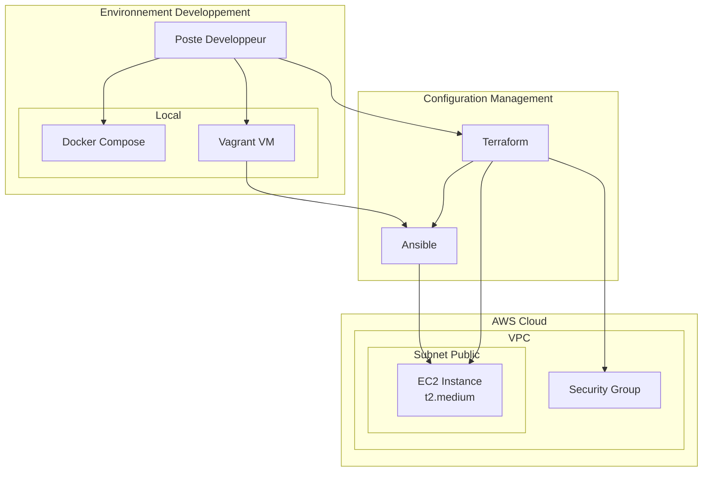
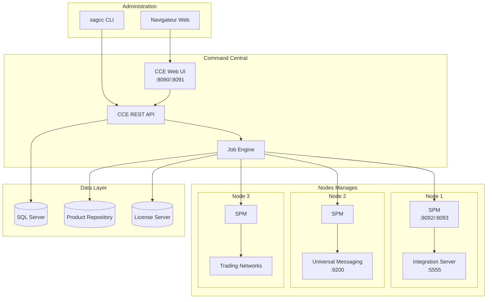
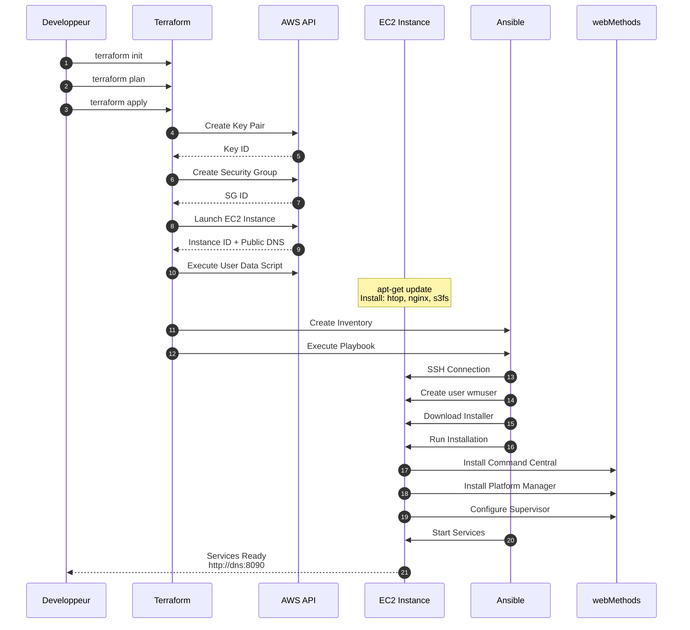
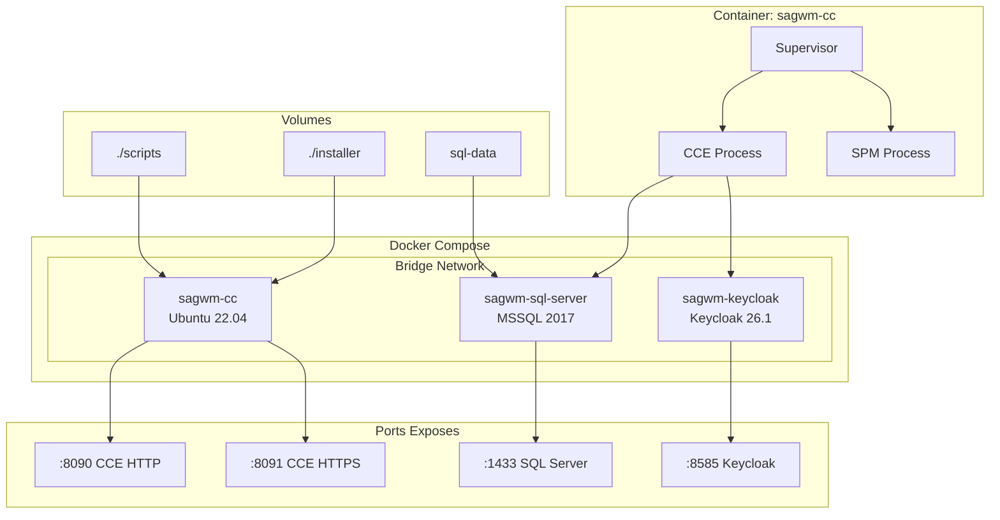
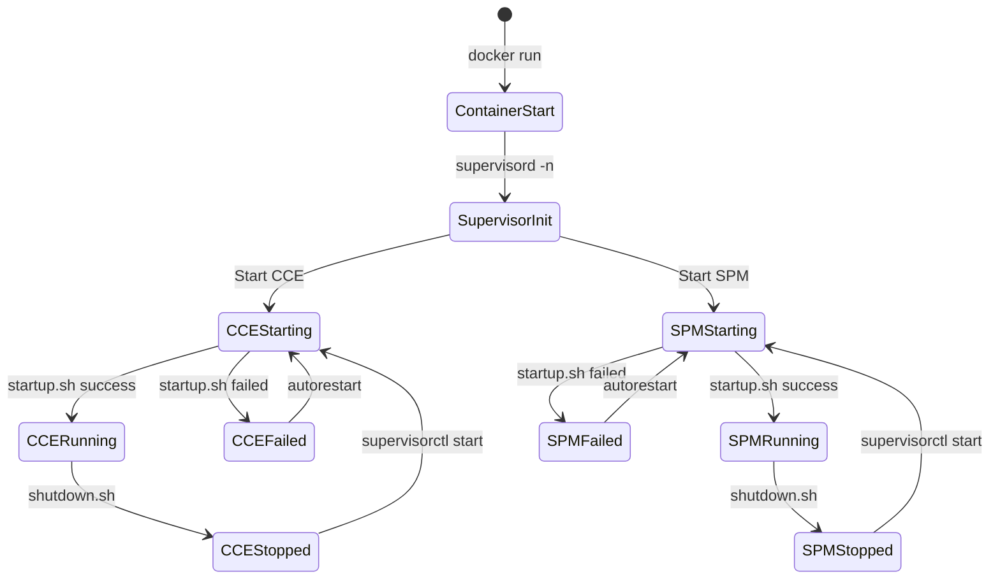
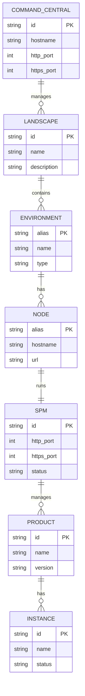
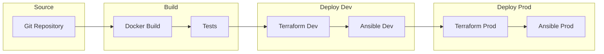

# Diagrammes d'architecture

## Architecture de deploiement

### Vue globale multi-environnement

---

## Architecture webMethods

### Topologie Command Central

---

## Flux de provisioning

### Deploiement Terraform + Ansible

---

## Architecture Container

### Docker Compose Stack

---

## Cycle de vie des services

### Demarrage avec Supervisor

---

## Modele de donnees

### Relations principales

---

## Integration CI/CD (Future)

### Pipeline propose

