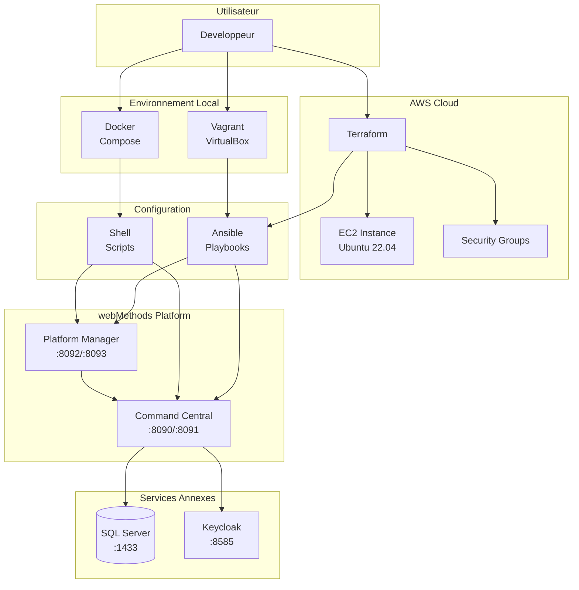
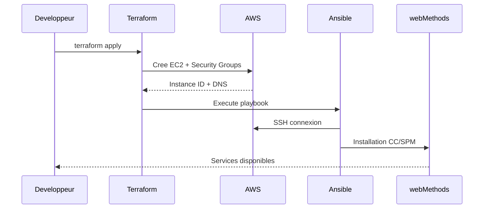
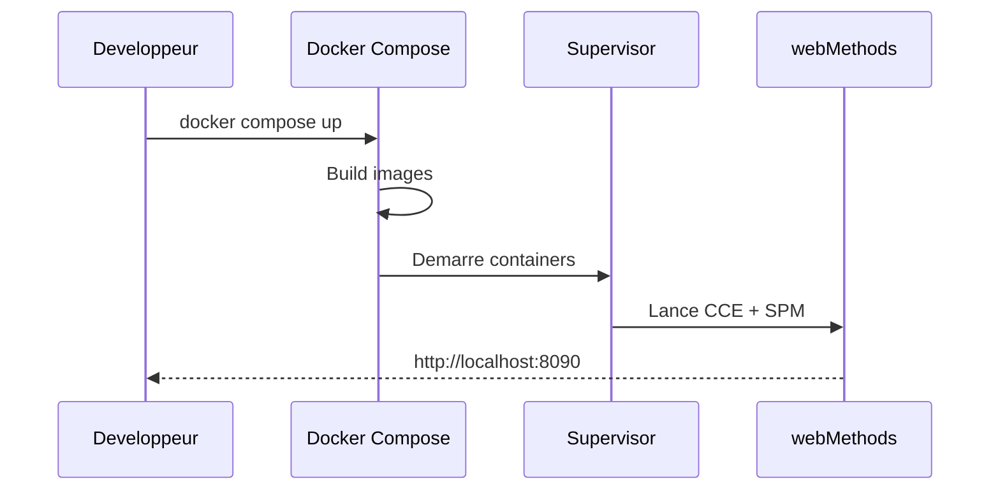
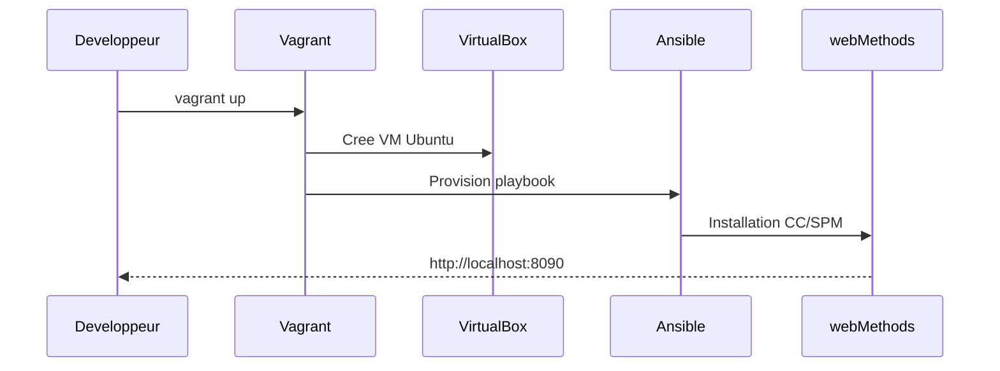
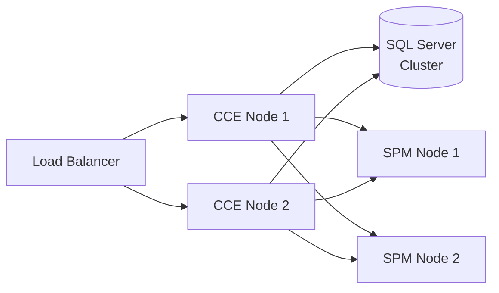

# Vue d'ensemble de l'architecture

## Architecture globale

Ce projet implemente une architecture **multi-couche** permettant le deploiement de webMethods Command Central dans differents environnements.



---

## Flux de deploiement

### Option 1 : Deploiement AWS (Production)



### Option 2 : Deploiement Local (Docker)



### Option 3 : Deploiement Local (Vagrant)



---

## Composants webMethods

### Command Central (CCE)

Le **coeur** de l'administration webMethods :

| Aspect | Detail |
|--------|--------|
| **Role** | Console d'administration centralisee |
| **Ports** | 8090 (HTTP), 8091 (HTTPS) |
| **Profil** | `/opt/SAGCommandCentral/profiles/CCE/` |
| **CLI** | `sagcc` |

### Platform Manager (SPM)

L'**agent** de deploiement sur chaque noeud :

| Aspect | Detail |
|--------|--------|
| **Role** | Gestion locale des produits SAG |
| **Ports** | 8092 (HTTP), 8093 (HTTPS) |
| **Profil** | `/opt/SAGCommandCentral/profiles/SPM/` |
| **Communication** | Vers CCE via REST API |

---

## Structure des repertoires

```
/opt/SAGCommandCentral/           # SAG_HOME
├── CommandCentral/
│   └── client/
│       └── bin/
│           └── sagcc             # CLI Command Central
├── profiles/
│   ├── CCE/                      # Profil Command Central
│   │   └── bin/
│   │       ├── startup.sh
│   │       └── shutdown.sh
│   └── SPM/                      # Profil Platform Manager
│       └── bin/
│           ├── startup.sh
│           └── shutdown.sh
├── common/                       # Librairies partagees
└── install/                      # Logs d'installation
```

---

## Ports et securite

### Matrice des ports

| Service | Port HTTP | Port HTTPS | Usage |
|---------|-----------|------------|-------|
| Command Central | 8090 | 8091 | Administration |
| Platform Manager | 8092 | 8093 | Agent local |
| Integration Server | 5555 | - | Services REST/SOAP |
| Universal Messaging | 9200 | - | Messaging |
| IS Diagnostic | 9999 | - | Debug |
| SQL Server | 1433 | - | Base de donnees |
| Keycloak | 8585 | - | Authentification |

### Security Groups AWS

```hcl
# Regles d'entree configurees
ingress {
  from_port   = 8090
  to_port     = 8094
  protocol    = "tcp"
  cidr_blocks = ["0.0.0.0/0"]
  description = "webMethods CC & SPM"
}

ingress {
  from_port   = 5555
  to_port     = 5555
  protocol    = "tcp"
  cidr_blocks = ["0.0.0.0/0"]
  description = "Integration Server"
}
```

---

## Gestion des processus

### Supervisor (Containers/VM)

```ini
[program:commandcentral]
command=/opt/SAGCommandCentral/profiles/CCE/bin/startup.sh
autostart=true
autorestart=true
stdout_logfile=/var/log/supervisor/cce.log

[program:platformmanager]
command=/opt/SAGCommandCentral/profiles/SPM/bin/startup.sh
autostart=true
autorestart=true
stdout_logfile=/var/log/supervisor/spm.log
```

**Avantages de Supervisor :**

- Redemarrage automatique en cas de crash
- Gestion unifiee des logs
- Compatible containers (pas besoin de systemd)
- Interface de controle (`supervisorctl`)

---

## Considerations de production

### Haute disponibilite



### Checklist production

- [ ] Activer HTTPS uniquement
- [ ] Configurer certificats SSL valides
- [ ] Restreindre les Security Groups
- [ ] Configurer la sauvegarde SQL Server
- [ ] Mettre en place le monitoring
- [ ] Configurer les alertes
