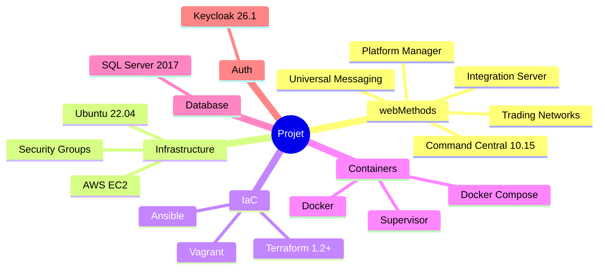

# Stack technique

## Vue d'ensemble des technologies



---

## Software AG webMethods

### Produits utilises

| Produit | Version | Role |
|---------|---------|------|
| **Command Central** | 10.15 Fix 8 | Console d'administration |
| **Platform Manager** | 10.15 | Agent de deploiement |
| **Integration Server** | 10.15 | Serveur d'integration |
| **Universal Messaging** | 10.15 | Broker de messages |
| **Trading Networks** | 10.15 | B2B Gateway |

### Installateur

```bash
# Installateur utilise
cc-def-10.15-fix8-lnxamd64.sh

# Options d'installation
-d $SAG_HOME           # Repertoire d'installation
-H localhost           # Hostname
-c 8090                # CCE HTTP port
-C 8091                # CCE HTTPS port
-s 8092                # SPM HTTP port
-S 8093                # SPM HTTPS port
-p $PASSWORD           # Mot de passe admin
--accept-license       # Acceptation licence
```

---

## Infrastructure Cloud (AWS)

### Ressources Terraform

```hcl
# Instance EC2
resource "aws_instance" "sag_cc_spm_server" {
  ami           = data.aws_ami.ubuntu22canonical.id
  instance_type = "t2.medium"
  key_name      = aws_key_pair.deployer.key_name

  vpc_security_group_ids = [
    aws_security_group.cc-spm-security-group.id
  ]

  user_data = <<-EOF
    #!/bin/bash
    apt-get update
    apt-get install -y htop s3fs curl nginx
    systemctl start nginx
    systemctl enable nginx
  EOF

  tags = {
    Name        = var.instance_slug
    Environment = "Development"
  }
}
```

### AMI utilisee

```hcl
data "aws_ami" "ubuntu22canonical" {
  most_recent = true

  filter {
    name   = "name"
    values = ["ubuntu/images/hvm-ssd/ubuntu-jammy-22.04-amd64-server-*"]
  }

  owners = ["099720109477"]  # Canonical
}
```

---

## Configuration Management (Ansible)

### Structure des playbooks

```yaml
# Variables communes
username: wmuser
groupname: sagwm
user_uid: 1234
group_gid: 1234
password: manage123
cc_admin_password: "manage123"
sag_home: /opt/SAGCommandCentral
cc_cli_home: "{{ sag_home }}/CommandCentral/client"
cce_http_port: 8090
cce_https_port: 8091
spm_http_port: 8092
spm_https_port: 8093
```

### Taches principales

1. **Preparation systeme**
   - Mise a jour packages
   - Creation utilisateur `wmuser`
   - Configuration sudo

2. **Installation**
   - Telechargement installateur (optionnel)
   - Execution installation
   - Configuration environnement

3. **Services**
   - Configuration Supervisor
   - Demarrage CCE et SPM
   - Verification sante

---

## Containerisation (Docker)

### Images construites

| Image | Base | Usage |
|-------|------|-------|
| `sagwm-cc` | Ubuntu 22.04 | CC + SPM complet |
| `sagwm-spm` | Ubuntu 22.04 | SPM seul |
| `sagwm-cc-oracle` | Oracle Linux 8 | Alternative enterprise |

### Docker Compose

```yaml
services:
  sagwm-cc:
    build:
      context: .
      dockerfile: docker/Dockerfile.supervisor
    ports:
      - "8090:8090"  # CCE HTTP
      - "8091:8091"  # CCE HTTPS
    environment:
      - CC_INSTALLER_PATH=/installer/cc-def-10.15-fix8-lnxamd64.sh
      - CC_ADMIN_PASSWORD=manage123
    volumes:
      - ./scripts:/scripts:ro
      - ./installer:/installer:ro

  sagwm-sql-server:
    image: mcr.microsoft.com/mssql/server:2017-latest
    ports:
      - "1433:1433"
    environment:
      - ACCEPT_EULA=Y
      - SA_PASSWORD=YourStrong!Passw0rd

  sagwm-keycloak:
    image: quay.io/keycloak/keycloak:26.1.1
    ports:
      - "8585:8080"
    environment:
      - KEYCLOAK_ADMIN=admin
      - KEYCLOAK_ADMIN_PASSWORD=admin
```

---

## Developpement local (Vagrant)

### Configuration VM

```ruby
Vagrant.configure("2") do |config|
  config.vm.box = "ubuntu/jammy64"

  config.vm.provider "virtualbox" do |vb|
    vb.memory = "4096"
    vb.cpus = 2
  end

  config.vm.network "forwarded_port", guest: 8090, host: 8090
  config.vm.network "forwarded_port", guest: 8091, host: 8091
  config.vm.network "forwarded_port", guest: 8092, host: 8092
  config.vm.network "forwarded_port", guest: 8093, host: 8093

  config.vm.synced_folder "./installer", "/installer"

  config.vm.provision "ansible" do |ansible|
    ansible.playbook = "ansible/playbook-with-supervisor.yml"
  end
end
```

---

## Base de donnees

### SQL Server 2017

Utilise pour :

- **Configuration storage** : Parametres Command Central
- **Audit logs** : Historique des operations
- **Archive** : Donnees historiques

### Configuration

```bash
# Creation des schemas
dbConfigurator.bat -a create \
  -d sqlserver \
  -c storage \
  -v latest \
  -l "jdbc:wm:sqlserver://localhost:1433;databaseName=webmethods_cc"
```

---

## Authentification (Keycloak)

### Integration prevue

- **SSO** pour Command Central
- **OAuth 2.0 / OIDC** pour les APIs
- **Federation d'identites**

### Configuration de base

```yaml
keycloak:
  image: quay.io/keycloak/keycloak:26.1.1
  command: start-dev
  ports:
    - "8585:8080"
  environment:
    - KEYCLOAK_ADMIN=admin
    - KEYCLOAK_ADMIN_PASSWORD=admin
```

---

## Outils de developpement

| Outil | Usage |
|-------|-------|
| **Git** | Version control |
| **VS Code** | IDE |
| **Docker Desktop** | Containers locaux |
| **VirtualBox** | VMs Vagrant |
| **AWS CLI** | Gestion cloud |
| **Terraform CLI** | IaC |
