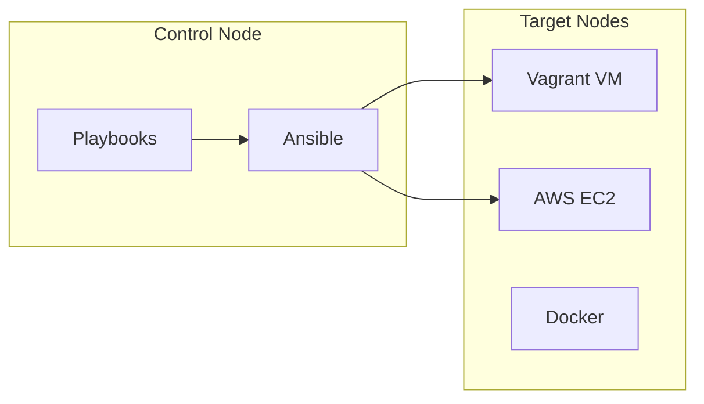

# Ansible - Configuration Management

## Vue d'ensemble

Ce projet utilise **Ansible** pour automatiser l'installation et la configuration de webMethods Command Central sur les serveurs cibles.



---

## Structure des playbooks

```
ansible/
├── playbook.yml                        # Installation basique
├── playbook-with-supervisor.yml        # Avec gestion services
└── playbook-with-supervisor-online.yml # Avec telechargement
```

### Comparaison des playbooks

| Playbook | Lignes | Supervisor | Download | Usage |
|----------|--------|------------|----------|-------|
| `playbook.yml` | 136 | Non | Non | Tests rapides |
| `playbook-with-supervisor.yml` | 238 | Oui | Non | Vagrant/Local |
| `playbook-with-supervisor-online.yml` | 250 | Oui | Oui | AWS/Cloud |

---

## Variables communes

```yaml
vars:
  # Utilisateur systeme
  username: wmuser
  groupname: sagwm
  user_uid: 1234
  group_gid: 1234
  password: manage123

  # Installation webMethods
  sag_home: /opt/SAGCommandCentral
  cc_cli_home: "{{ sag_home }}/CommandCentral/client"
  cc_admin_password: "manage123"

  # Ports
  cce_http_port: 8090
  cce_https_port: 8091
  spm_http_port: 8092
  spm_https_port: 8093

  # Chemins
  installer_path: /installer/cc-def-10.15-fix8-lnxamd64.sh
  cc_installer_url: ""  # URL S3 pour download
```

---

## Taches principales

### 1. Preparation systeme

```yaml
- name: Update apt cache
  become: yes
  apt:
    update_cache: yes
    cache_valid_time: 3600

- name: Install required packages
  become: yes
  apt:
    name:
      - supervisor
      - curl
      - unzip
    state: present
```

### 2. Creation utilisateur

```yaml
- name: Ensure group exists
  become: yes
  group:
    name: "{{ groupname }}"
    gid: "{{ group_gid }}"
    state: present

- name: Create webMethods user
  become: yes
  user:
    name: "{{ username }}"
    uid: "{{ user_uid }}"
    group: "{{ groupname }}"
    shell: /bin/bash
    home: "/home/{{ username }}"
    create_home: yes
    password: "{{ password | password_hash('sha512') }}"
```

### 3. Configuration SSH

```yaml
- name: Create .ssh directory
  become: yes
  file:
    path: "/home/{{ username }}/.ssh"
    state: directory
    owner: "{{ username }}"
    group: "{{ groupname }}"
    mode: '0700'

- name: Copy SSH keys from vagrant user
  become: yes
  copy:
    src: /home/vagrant/.ssh/authorized_keys
    dest: "/home/{{ username }}/.ssh/authorized_keys"
    remote_src: yes
    owner: "{{ username }}"
    group: "{{ groupname }}"
    mode: '0600'
```

### 4. Configuration sudo

```yaml
- name: Allow sudo without password
  become: yes
  lineinfile:
    path: /etc/sudoers.d/{{ username }}
    line: "{{ username }} ALL=(ALL) NOPASSWD:ALL"
    create: yes
    validate: 'visudo -cf %s'
    mode: '0440'
```

### 5. Telechargement installateur (Online)

```yaml
- name: Download installer from URL
  become: yes
  become_user: "{{ username }}"
  get_url:
    url: "{{ cc_installer_url }}"
    dest: "{{ installer_path }}"
    mode: '0755'
  when: cc_installer_url != ""

- name: Check installer file size
  become: yes
  stat:
    path: "{{ installer_path }}"
  register: installer_stat

- name: Debug installer info
  debug:
    msg: "Installer size: {{ installer_stat.stat.size | default(0) }} bytes"
```

### 6. Execution installation

```yaml
- name: Check if installer already run
  become: yes
  stat:
    path: "{{ sag_home }}/.installer_run"
  register: installer_flag

- name: Run Command Central installer
  become: yes
  become_user: "{{ username }}"
  shell: |
    {{ installer_path }} \
      -d {{ sag_home }} \
      -H {{ ansible_hostname }} \
      -c {{ cce_http_port }} \
      -C {{ cce_https_port }} \
      -s {{ spm_http_port }} \
      -S {{ spm_https_port }} \
      -p {{ cc_admin_password }} \
      --accept-license
  args:
    creates: "{{ sag_home }}/.installer_run"
  when: not installer_flag.stat.exists

- name: Create installer flag
  become: yes
  file:
    path: "{{ sag_home }}/.installer_run"
    state: touch
    owner: "{{ username }}"
  when: not installer_flag.stat.exists
```

### 7. Configuration Supervisor

```yaml
- name: Create supervisor config for CCE
  become: yes
  copy:
    dest: /etc/supervisor/conf.d/commandcentral.conf
    content: |
      [program:commandcentral]
      command={{ sag_home }}/profiles/CCE/bin/startup.sh
      directory={{ sag_home }}/profiles/CCE
      user={{ username }}
      autostart=true
      autorestart=true
      startsecs=30
      startretries=3
      stdout_logfile=/var/log/supervisor/cce-stdout.log
      stderr_logfile=/var/log/supervisor/cce-stderr.log
      environment=SAG_HOME="{{ sag_home }}"

- name: Create supervisor config for SPM
  become: yes
  copy:
    dest: /etc/supervisor/conf.d/platformmanager.conf
    content: |
      [program:platformmanager]
      command={{ sag_home }}/profiles/SPM/bin/startup.sh
      directory={{ sag_home }}/profiles/SPM
      user={{ username }}
      autostart=true
      autorestart=true
      startsecs=30
      startretries=3
      stdout_logfile=/var/log/supervisor/spm-stdout.log
      stderr_logfile=/var/log/supervisor/spm-stderr.log
      environment=SAG_HOME="{{ sag_home }}"

- name: Reload supervisor
  become: yes
  shell: supervisorctl reread && supervisorctl update

- name: Start services
  become: yes
  supervisorctl:
    name: "{{ item }}"
    state: started
  loop:
    - commandcentral
    - platformmanager
```

### 8. Configuration environnement

```yaml
- name: Create .profile
  become: yes
  copy:
    dest: "/home/{{ username }}/.profile"
    content: |
      export SAG_HOME={{ sag_home }}
      export CC_CLI_HOME={{ cc_cli_home }}
      export PATH=$PATH:$CC_CLI_HOME/bin
      source {{ sag_home }}/profiles/CCE/bin/sagccEnv.sh 2>/dev/null || true
    owner: "{{ username }}"
    group: "{{ groupname }}"
```

---

## Execution des playbooks

### Avec Vagrant

```bash
# Le playbook s'execute automatiquement
vagrant up

# Re-executer le playbook
vagrant provision
```

### Standalone

```bash
# Avec inventaire
ansible-playbook -i inventory.ini playbook-with-supervisor.yml

# Variables en ligne
ansible-playbook playbook-with-supervisor.yml \
  -e "ansible_user=ubuntu" \
  -e "ansible_ssh_private_key_file=~/.ssh/key.pem" \
  -e "cc_admin_password=MySecurePass"
```

### Via Terraform

Le playbook est execute automatiquement via le provider Ansible de Terraform.

---

## Idempotence

Le playbook est **idempotent** - il peut etre execute plusieurs fois sans effets secondaires :

```yaml
# Flag pour eviter reinstallation
args:
  creates: "{{ sag_home }}/.installer_run"

# Condition explicite
when: not installer_flag.stat.exists
```

---

## Debugging

### Mode verbose

```bash
ansible-playbook playbook.yml -vvv
```

### Taches de debug

```yaml
- name: Debug variables
  debug:
    msg: |
      SAG_HOME: {{ sag_home }}
      Hostname: {{ ansible_hostname }}
      Installer: {{ installer_path }}
```

### Check mode (dry-run)

```bash
ansible-playbook playbook.yml --check
```

---

## Bonnes pratiques implementees

1. **Become explicite** - `become: yes` pour les taches root
2. **Become_user** - Execution en tant que `wmuser` pour l'installation
3. **Handlers** - Reload supervisor apres changement config
4. **Templates** - Configuration dynamique
5. **Idempotence** - Flag files pour eviter re-execution
6. **Validation** - `validate` pour sudoers
7. **Modes fichiers** - Permissions explicites (0755, 0600, etc.)
