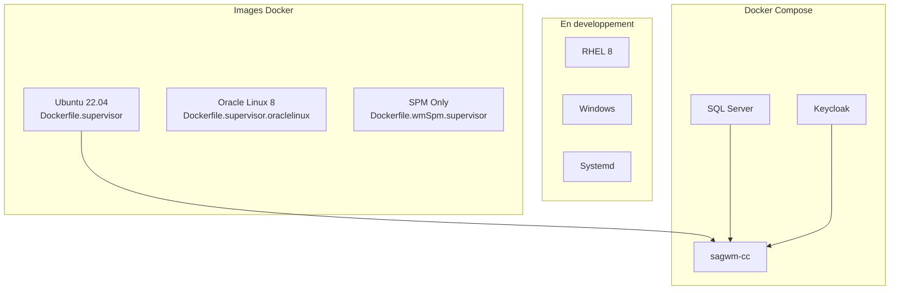

# Docker - Containerisation

## Vue d'ensemble

Ce projet propose plusieurs **Dockerfiles** pour containeriser webMethods Command Central, avec differentes approches et systemes de base.



---

## Dockerfiles disponibles

| Fichier | Base | Status | Usage |
|---------|------|--------|-------|
| `Dockerfile.supervisor` | Ubuntu 22.04 | Production | CCE + SPM complet |
| `Dockerfile.supervisor.oraclelinux` | Oracle Linux 8 | Production | Alternative enterprise |
| `Dockerfile.wmSpm.supervisor` | Ubuntu 22.04 | Production | SPM seul |
| `Dockerfile.systemd.tofix` | Ubuntu | WIP | Approche systemd |
| `Dockerfile.rhel8.tofix` | RHEL 8 | WIP | Compatibilite RHEL |
| `Dockerfile.windows.tofix` | Windows | WIP | Containers Windows |

---

## Dockerfile principal (Ubuntu + Supervisor)

```dockerfile
# docker/Dockerfile.supervisor

FROM ubuntu:22.04

# Arguments de build
ARG CC_INSTALLER_PATH=/installer/cc-def-10.15-fix8-lnxamd64.sh
ARG CC_ADMIN_PASSWORD=manage123
ARG CC_ADMIN_HOST=localhost

# Variables d'environnement
ENV SAG_HOME=/opt/SAGCommandCentral
ENV USERNAME=wmuser
ENV GROUPNAME=sagwm
ENV USER_UID=1234
ENV GROUP_GID=1234

# Installation des packages
RUN apt-get update && apt-get install -y \
    supervisor \
    curl \
    unzip \
    && rm -rf /var/lib/apt/lists/*

# Creation utilisateur
RUN groupadd -g ${GROUP_GID} ${GROUPNAME} && \
    useradd -u ${USER_UID} -g ${GROUPNAME} -m -s /bin/bash ${USERNAME}

# Repertoires
RUN mkdir -p ${SAG_HOME} && \
    chown -R ${USERNAME}:${GROUPNAME} ${SAG_HOME}

# Copie des scripts
COPY scripts/ /scripts/
RUN chmod +x /scripts/*.sh

# Configuration Supervisor
COPY docker/supervisor/*.conf /etc/supervisor/conf.d/

# Ports exposes
EXPOSE 8090 8091 8092 8093

# Point d'entree
CMD ["supervisord", "-n", "-c", "/etc/supervisor/supervisord.conf"]
```

---

## Configuration Supervisor

### Command Central (CCE)

```ini
# docker/supervisor/commandcentral.conf

[program:commandcentral]
command=/opt/SAGCommandCentral/profiles/CCE/bin/startup.sh
directory=/opt/SAGCommandCentral/profiles/CCE
user=wmuser
autostart=true
autorestart=true
startsecs=30
startretries=3
stdout_logfile=/var/log/supervisor/cce-stdout.log
stderr_logfile=/var/log/supervisor/cce-stderr.log
stdout_logfile_maxbytes=50MB
stderr_logfile_maxbytes=50MB
environment=SAG_HOME="/opt/SAGCommandCentral"
```

### Platform Manager (SPM)

```ini
# docker/supervisor/platformmanager.conf

[program:platformmanager]
command=/opt/SAGCommandCentral/profiles/SPM/bin/startup.sh
directory=/opt/SAGCommandCentral/profiles/SPM
user=wmuser
autostart=true
autorestart=true
startsecs=30
startretries=3
stdout_logfile=/var/log/supervisor/spm-stdout.log
stderr_logfile=/var/log/supervisor/spm-stderr.log
stdout_logfile_maxbytes=50MB
stderr_logfile_maxbytes=50MB
environment=SAG_HOME="/opt/SAGCommandCentral"
```

---

## Docker Compose

```yaml
# compose.yml

services:
  # Command Central + SPM
  sagwm-cc:
    build:
      context: .
      dockerfile: docker/Dockerfile.supervisor
      args:
        CC_INSTALLER_PATH: /installer/cc-def-10.15-fix8-lnxamd64.sh
        CC_ADMIN_PASSWORD: manage123
    ports:
      - "8090:8090"   # CCE HTTP
      - "8091:8091"   # CCE HTTPS
    environment:
      - CC_INSTALLER_PATH=/installer/cc-def-10.15-fix8-lnxamd64.sh
      - CC_ZIP_LICENCE_PATH=/installer/licence.zip
      - CC_DB_URL=jdbc:wm:sqlserver://sagwm-sql-server:1433
    volumes:
      - ./scripts:/scripts:ro
      - ./installer:/installer:ro
    depends_on:
      - sagwm-sql-server

  # SPM standalone (optionnel)
  sagwm-spm:
    build:
      context: .
      dockerfile: docker/Dockerfile.wmSpm.supervisor
    ports:
      - "8292:8092"
      - "8293:8093"
    profiles:
      - spm-standalone

  # SQL Server
  sagwm-sql-server:
    image: mcr.microsoft.com/mssql/server:2017-latest
    ports:
      - "1433:1433"
    environment:
      - ACCEPT_EULA=Y
      - SA_PASSWORD=YourStrong!Passw0rd
    volumes:
      - sql-data:/var/opt/mssql

  # Keycloak (SSO)
  sagwm-keycloak:
    image: quay.io/keycloak/keycloak:26.1.1
    command: start-dev
    ports:
      - "8585:8080"
    environment:
      - KEYCLOAK_ADMIN=admin
      - KEYCLOAK_ADMIN_PASSWORD=admin

volumes:
  sql-data:
```

---

## Utilisation

### Build

```bash
# Build image principale
docker compose build sagwm-cc

# Build avec arguments personnalises
docker compose build \
  --build-arg CC_ADMIN_PASSWORD=MySecurePass \
  sagwm-cc
```

### Demarrage

```bash
# Demarrer tous les services
docker compose up -d

# Demarrer seulement CC + SQL
docker compose up -d sagwm-cc sagwm-sql-server

# Avec profil SPM standalone
docker compose --profile spm-standalone up -d
```

### Verification

```bash
# Status des containers
docker compose ps

# Logs en temps reel
docker compose logs -f sagwm-cc

# Status Supervisor dans le container
docker compose exec sagwm-cc supervisorctl status
```

### Arret

```bash
# Arreter les services
docker compose down

# Arreter et supprimer les volumes
docker compose down -v
```

---

## Gestion des services

### Commandes Supervisor

```bash
# Entrer dans le container
docker compose exec sagwm-cc bash

# Status des services
supervisorctl status

# Redemarrer CCE
supervisorctl restart commandcentral

# Arreter SPM
supervisorctl stop platformmanager

# Voir les logs
supervisorctl tail -f commandcentral
```

---

## Multi-plateforme

### Oracle Linux 8

```dockerfile
# docker/Dockerfile.supervisor.oraclelinux

FROM oraclelinux:8

RUN dnf install -y \
    supervisor \
    curl \
    unzip \
    && dnf clean all

# ... reste similaire
```

**Avantages Oracle Linux :**

- Compatibilite RHEL
- Support enterprise
- Certifications Oracle

### Windows (Experimental)

```dockerfile
# docker/Dockerfile.windows.tofix

FROM mcr.microsoft.com/windows/servercore:ltsc2019

# En cours de developpement
# Necessite Windows containers
```

---

## Volumes et persistance

```yaml
volumes:
  # Scripts (lecture seule)
  - ./scripts:/scripts:ro

  # Installateur (lecture seule)
  - ./installer:/installer:ro

  # Donnees SQL Server (persistant)
  - sql-data:/var/opt/mssql

  # Logs (optionnel)
  - ./logs:/var/log/supervisor
```

---

## Healthchecks

```yaml
services:
  sagwm-cc:
    # ...
    healthcheck:
      test: ["CMD", "curl", "-f", "http://localhost:8090/sag/cce/v1/health"]
      interval: 30s
      timeout: 10s
      retries: 3
      start_period: 120s
```

---

## Bonnes pratiques

1. **Supervisor plutot que systemd** - Plus adapte aux containers
2. **Multi-stage builds** - Reduire la taille des images
3. **Volumes read-only** - Securite pour scripts et installateur
4. **Healthchecks** - Detection automatique des problemes
5. **Logs centralises** - Via Supervisor vers stdout
6. **Variables d'environnement** - Configuration flexible
