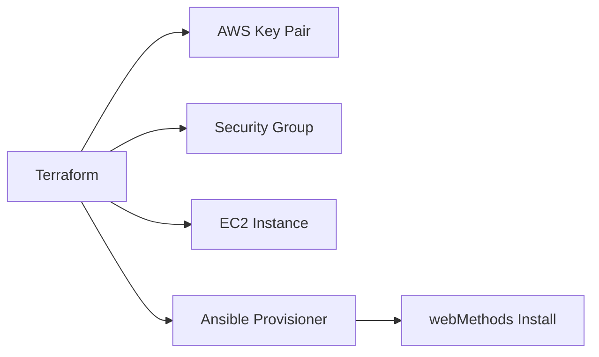

# Terraform - Infrastructure AWS

## Vue d'ensemble

Ce projet utilise **Terraform** pour provisionner l'infrastructure AWS necessaire au deploiement de webMethods Command Central.



---

## Structure des fichiers

```
terraform/
├── main.tf           # Ressources principales (EC2, Key Pair)
├── variables.tf      # Variables d'entree
├── security.tf       # Security Groups
├── ansible.tf        # Integration Ansible
├── data.tf           # Data sources (AMI)
├── output.tf         # Outputs
├── version.tf        # Providers
└── ssh-key/          # Cles SSH
    ├── nkaurelien.pub
    └── nkaurelien.key
```

---

## Configuration des providers

```hcl
# version.tf

terraform {
  required_providers {
    ansible = {
      source  = "jdziat/ansible"
      version = "1.2.1"
    }
    aws = {
      source  = "hashicorp/aws"
      version = "~> 4.16"
    }
  }

  required_version = ">= 1.2.0"
}
```

---

## Variables

```hcl
# variables.tf

variable "instance_slug" {
  type        = string
  default     = "webmethods-cc-server"
  description = "Nom de l'instance EC2"
}

variable "key-name" {
  type        = string
  default     = "dev/nkaurelien"
  description = "Nom de la key pair AWS"
}

variable "ssh_public_key" {
  type        = string
  default     = "ssh-key/nkaurelien.pub"
  description = "Chemin vers la cle publique SSH"
}

variable "ssh_user" {
  type        = string
  default     = "ubuntu"
  description = "Utilisateur SSH"
}

variable "ssh_private_key" {
  type        = string
  default     = "ssh-key/nkaurelien.key"
  description = "Chemin vers la cle privee SSH"
}
```

---

## Data Sources

```hcl
# data.tf

# Selection automatique de l'AMI Ubuntu 22.04 la plus recente
data "aws_ami" "ubuntu22canonical" {
  most_recent = true

  filter {
    name   = "name"
    values = ["ubuntu/images/hvm-ssd/ubuntu-jammy-22.04-amd64-server-*"]
  }

  filter {
    name   = "virtualization-type"
    values = ["hvm"]
  }

  owners = ["099720109477"]  # Canonical (editeur officiel Ubuntu)
}
```

**Avantages de cette approche :**

- Toujours la derniere version Ubuntu 22.04
- Patches de securite automatiques
- Pas besoin de maintenir un ID AMI

---

## Ressources principales

### Key Pair

```hcl
# main.tf

resource "aws_key_pair" "deployer" {
  key_name   = var.key-name
  public_key = file(var.ssh_public_key)
}
```

### Instance EC2

```hcl
resource "aws_instance" "sag_cc_spm_server" {
  ami           = data.aws_ami.ubuntu22canonical.id
  instance_type = "t2.medium"
  key_name      = aws_key_pair.deployer.key_name

  vpc_security_group_ids = [
    aws_security_group.cc-spm-security-group.id
  ]

  # Script de bootstrap
  user_data = <<-EOF
    #!/bin/bash
    apt-get update
    apt-get install -y htop s3fs curl nginx
    systemctl start nginx
    systemctl enable nginx
  EOF

  tags = {
    Name        = var.instance_slug
    Creator     = "Terraform"
    Environment = "Development"
    Company     = "SAG"
  }
}
```

**Instance t2.medium :**

- 2 vCPU
- 4 GB RAM
- Suffisant pour dev/test
- Production: t2.large ou plus

---

## Security Groups

```hcl
# security.tf

resource "aws_security_group" "cc-spm-security-group" {
  name        = "cc-spm-security-group"
  description = "Security group for webMethods CC and SPM"

  # HTTP standard
  ingress {
    from_port   = 80
    to_port     = 80
    protocol    = "tcp"
    cidr_blocks = ["0.0.0.0/0"]
    description = "HTTP"
  }

  # HTTPS standard
  ingress {
    from_port   = 443
    to_port     = 443
    protocol    = "tcp"
    cidr_blocks = ["0.0.0.0/0"]
    description = "HTTPS"
  }

  # SSH
  ingress {
    from_port   = 22
    to_port     = 22
    protocol    = "tcp"
    cidr_blocks = ["0.0.0.0/0"]
    description = "SSH"
  }

  # Command Central & SPM
  ingress {
    from_port   = 8090
    to_port     = 8094
    protocol    = "tcp"
    cidr_blocks = ["0.0.0.0/0"]
    description = "webMethods CC & SPM"
  }

  # Integration Server
  ingress {
    from_port   = 5555
    to_port     = 5555
    protocol    = "tcp"
    cidr_blocks = ["0.0.0.0/0"]
    description = "Integration Server"
  }

  # Universal Messaging
  ingress {
    from_port   = 9200
    to_port     = 9200
    protocol    = "tcp"
    cidr_blocks = ["0.0.0.0/0"]
    description = "Universal Messaging"
  }

  # IS Diagnostic
  ingress {
    from_port   = 9999
    to_port     = 9999
    protocol    = "tcp"
    cidr_blocks = ["0.0.0.0/0"]
    description = "IS Diagnostic port"
  }

  # Sortie - tout autoriser
  egress {
    from_port   = 0
    to_port     = 0
    protocol    = "-1"
    cidr_blocks = ["0.0.0.0/0"]
    description = "Allow all outbound"
  }
}
```

---

## Integration Ansible

```hcl
# ansible.tf

# Creer un groupe d'inventaire
resource "ansible_group" "webmethods" {
  name = "webmethods"
}

# Enregistrer l'instance dans le groupe
resource "ansible_host" "webmethods" {
  name   = aws_instance.sag_cc_spm_server.public_dns
  groups = [ansible_group.webmethods.name]
}

# Executer le playbook
resource "ansible_playbook" "webmethods" {
  name       = aws_instance.sag_cc_spm_server.public_dns
  playbook   = "../ansible/playbook-with-supervisor-online.yml"
  replayable = true

  extra_vars = {
    ansible_user                 = var.ssh_user
    ansible_ssh_private_key_file = abspath(var.ssh_private_key)
    ansible_ssh_common_args      = "-o StrictHostKeyChecking=no"

    # Ports webMethods
    cce_http_port  = 8090
    cce_https_port = 8091
    spm_http_port  = 8092
    spm_https_port = 8093

    # Credentials
    cc_admin_password = "manage123"

    # URL de l'installateur (S3 presigned URL)
    cc_installer_url = "https://bucket.s3.amazonaws.com/installer.sh?..."
  }
}
```

**Points cles :**

- Le playbook s'execute automatiquement apres creation EC2
- Variables passees dynamiquement
- Installateur telecharge depuis S3

---

## Outputs

```hcl
# output.tf

output "server_public_dns" {
  value       = aws_instance.sag_cc_spm_server.public_dns
  description = "DNS public de l'instance"
}

output "server_arn" {
  value       = aws_instance.sag_cc_spm_server.arn
  description = "ARN de l'instance"
}

output "server_host" {
  value       = aws_instance.sag_cc_spm_server.host_id
  description = "Host ID"
}

output "command_central_url" {
  value       = "http://${aws_instance.sag_cc_spm_server.public_dns}:8090/cce/web"
  description = "URL Command Central"
}
```

---

## Utilisation

### Initialisation

```bash
cd terraform

# Initialiser Terraform
terraform init

# Verifier la configuration
terraform validate
```

### Planification

```bash
# Voir les changements prevus
terraform plan

# Sauvegarder le plan
terraform plan -out=tfplan
```

### Deploiement

```bash
# Appliquer le plan
terraform apply

# Ou appliquer directement
terraform apply -auto-approve
```

### Destruction

```bash
# Detruire toute l'infrastructure
terraform destroy

# Destruction ciblee
terraform destroy -target=aws_instance.sag_cc_spm_server
```

---

## Bonnes pratiques implementees

### 1. Separation des concerns

```
main.tf      → Ressources principales
security.tf  → Regles reseau
variables.tf → Configuration
data.tf      → Sources de donnees
output.tf    → Exports
```

### 2. Tags systematiques

```hcl
tags = {
  Name        = var.instance_slug
  Creator     = "Terraform"
  Environment = "Development"
  Company     = "SAG"
}
```

### 3. AMI dynamique

Pas d'ID AMI en dur → toujours a jour

### 4. Integration IaC complete

Terraform + Ansible = Infrastructure + Configuration

---

## Ameliorations possibles

1. **Backend remote** (S3 + DynamoDB)
2. **Modules reutilisables**
3. **Workspaces** (dev/staging/prod)
4. **Variables sensibles** dans Vault
5. **Auto-scaling group** pour HA
