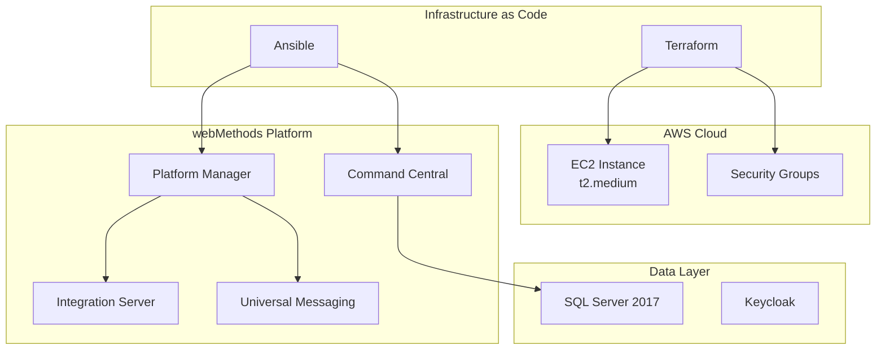

# Portfolio webMethods - Infrastructure & DevOps

## Projet : SAG webMethods Command Central - Infrastructure Automatisee

!!! info "A propos de ce projet"
    Ce projet personnel demontre mes competences en **developpement webMethods** et **DevOps** a travers la creation d'une infrastructure complete de deploiement automatise pour Software AG webMethods Command Central.

---

## Objectif du projet

Creer une **infrastructure de deploiement complete** pour webMethods Command Central permettant :

- Le deploiement automatise sur **AWS** (Cloud)
- Le developpement local avec **Docker** et **Vagrant**
- La gestion de configuration avec **Ansible**
- L'Infrastructure as Code avec **Terraform**

---

## Competences demontrees

### webMethods & Software AG

| Competence | Description |
|------------|-------------|
| **Command Central (CCE)** | Installation, configuration et administration |
| **Platform Manager (SPM)** | Gestion des noeuds et deploiements |
| **Integration Server (IS)** | Configuration des ports et services |
| **Universal Messaging (UM)** | Integration dans l'architecture |
| **CLI sagcc** | Automatisation via ligne de commande |
| **Gestion des licences** | Import et configuration |
| **Landscapes & Environments** | Organisation des environnements |

### DevOps & Infrastructure

| Competence | Description |
|------------|-------------|
| **Terraform** | Provisioning AWS (EC2, Security Groups) |
| **Ansible** | Configuration management, playbooks modulaires |
| **Docker** | Containerisation, Docker Compose, multi-stage |
| **Vagrant** | Environnements de dev locaux reproductibles |
| **Shell Scripting** | Automatisation, gestion d'erreurs |
| **Process Management** | Supervisor, systemd |

---

## Architecture du projet

```
sagwm-command-central/
├── ansible/                 # Playbooks Ansible (3 variantes)
├── docker/                  # Dockerfiles (6 variantes)
├── terraform/               # IaC AWS complet
├── scripts/                 # Scripts de provisioning
├── installer/               # Artefacts d'installation
├── compose.yml              # Orchestration Docker
└── Vagrantfile              # VM de developpement
```

---

## Stack technique



---

## Approche et methodologie

### 1. Learn by Doing
Ce projet a ete realise en **auto-formation** avec une approche iterative :

- Exploration de la documentation officielle Software AG
- Experimentation avec differentes approches (Docker, Vagrant, Cloud)
- Resolution de problemes en temps reel
- Documentation progressive des solutions

### 2. Infrastructure as Code
Toute l'infrastructure est **codifiee** et **reproductible** :

- Zero configuration manuelle
- Deploiement en une commande
- Environnements identiques (dev/prod)

### 3. Multi-environnement
Support de plusieurs contextes de deploiement :

| Environnement | Outil | Usage |
|---------------|-------|-------|
| Local (VM) | Vagrant | Developpement |
| Local (Container) | Docker Compose | Tests rapides |
| Cloud | Terraform + Ansible | Production |

---

## Metriques du projet

| Metrique | Valeur |
|----------|--------|
| **Commits Git** | 21 |
| **Lignes de code** | 750+ |
| **Playbooks Ansible** | 624 lignes |
| **Scripts Shell** | 127 lignes |
| **Dockerfiles** | 6 variantes |
| **Fichiers Terraform** | 7 modules |

---

## Points forts techniques

!!! success "Automatisation complete"
    Du provisioning cloud a l'installation webMethods, tout est automatise.

!!! success "Multi-plateforme"
    Support Ubuntu, Oracle Linux, RHEL, et Windows (experimental).

!!! success "Modularite"
    Architecture modulaire permettant d'utiliser chaque composant independamment.

!!! success "Documentation"
    Code documente et guides d'installation inclus.

---

## Navigation

- [Architecture technique](architecture/overview.md) - Vue detaillee de l'architecture
- [Competences webMethods](webmethods/command-central.md) - Details sur Command Central
- [DevOps & IaC](devops/terraform.md) - Infrastructure as Code
- [Parcours d'apprentissage](learning-journey.md) - Ma progression
- [Guide Entretien](interview-guide.md) - Reference rapide
