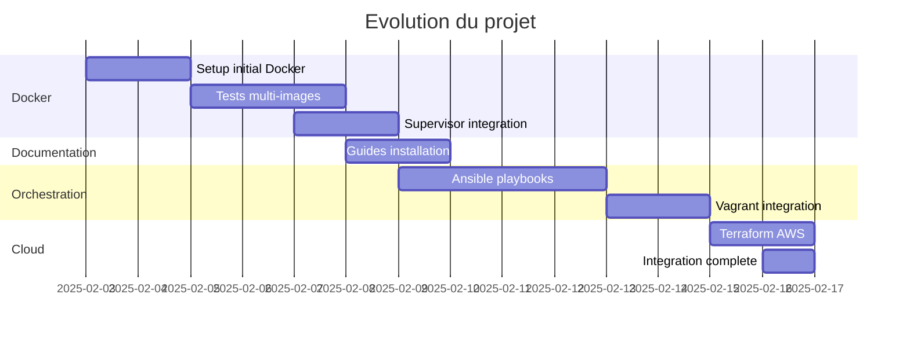
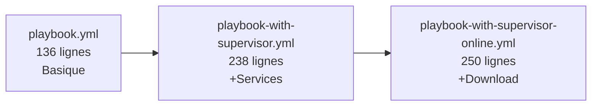
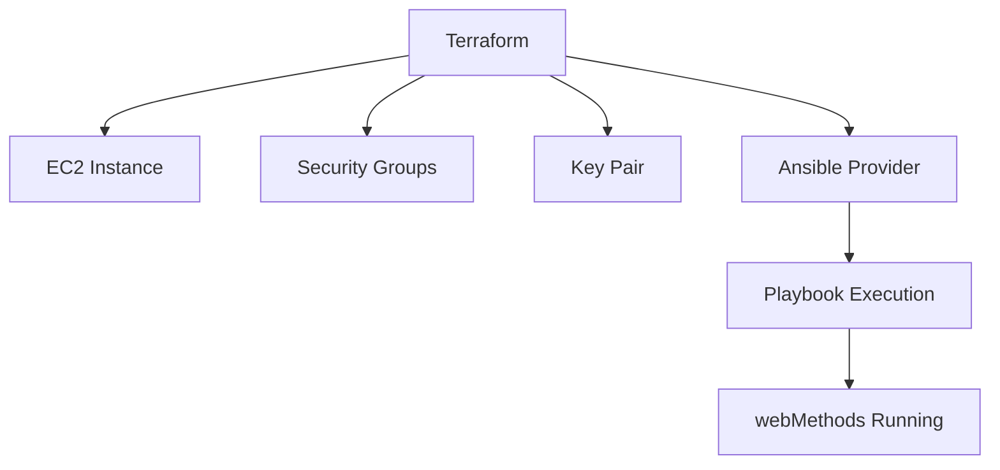

# Parcours d'apprentissage

## Ma progression - Learn by Doing

Ce document retrace mon **apprentissage autodidacte** de webMethods et des pratiques DevOps associees, a travers la realisation de ce projet.

---

## Timeline du projet



---

## Phase 1 : Containerisation (3-8 Fevrier)

### Objectif
Containeriser webMethods Command Central pour un deploiement rapide et reproductible.

### Defis rencontres

| Defi | Solution trouvee |
|------|------------------|
| Systemd dans Docker | Utilisation de Supervisor comme init system |
| Logs non visibles | Configuration stdout/stderr Supervisor |
| Permissions fichiers | Creation utilisateur wmuser avec UID fixe |
| Image trop volumineuse | Multi-stage build (en cours) |

### Apprentissages

1. **Supervisor vs Systemd** : Dans les containers, systemd pose des problemes car il necessite des privileges speciaux. Supervisor est une alternative legere et adaptee.

2. **Utilisateur non-root** : webMethods recommande un utilisateur dedie. J'ai appris a gerer les UID/GID pour la coherence entre host et container.

3. **Multi-plateforme** : J'ai experimente avec Ubuntu, Oracle Linux et RHEL pour comprendre les differences.

### Commits cles

```
47c16ee Update Docs
f02f1d1 Refactor Vagrantfile and create provision.sh
```

---

## Phase 2 : Configuration Management (9-14 Fevrier)

### Objectif
Automatiser l'installation avec Ansible pour la reproductibilite.

### Evolution des playbooks



### Defis rencontres

| Defi | Solution trouvee |
|------|------------------|
| Idempotence | Flag file `.installer_run` |
| Variables sensibles | Ansible vault (a implementer) |
| Telechargement installateur | Module `get_url` avec presigned URL |
| Ordre des taches | Separation create_directories avant install |

### Apprentissages

1. **Idempotence** : Un playbook doit pouvoir etre execute plusieurs fois sans effet de bord. J'utilise `creates:` et des conditions `when:`.

2. **Become vs Become_user** : Distinction entre escalade de privileges (become) et changement d'utilisateur (become_user).

3. **Handlers** : Declenchement d'actions suite a des changements (reload supervisor).

### Commits cles

```
51d91b3 Add ansible playbook
f02f1d1 Refactor Vagrantfile and create provision.sh
```

---

## Phase 3 : Infrastructure as Code (15-16 Fevrier)

### Objectif
Deployer automatiquement sur AWS avec Terraform + Ansible.

### Architecture realisee



### Defis rencontres

| Defi | Solution trouvee |
|------|------------------|
| Integration Terraform-Ansible | Provider jdziat/ansible |
| SSH key management | Fichiers locaux + aws_key_pair |
| Dynamic inventory | ansible_host resource |
| Installateur sur AWS | Presigned S3 URL |

### Apprentissages

1. **Terraform Providers** : Decouverte du provider Ansible pour Terraform permettant d'executer des playbooks directement.

2. **Data Sources** : Utilisation de `data.aws_ami` pour toujours avoir la derniere AMI Ubuntu.

3. **Security Groups** : Importance de bien definir les regles ingress/egress pour webMethods.

4. **Outputs** : Export des informations (DNS, URL) pour faciliter l'acces.

### Commits cles

```
f4c4be0 Create Infra with Terraform on aws and run install with ansible
7bfb006 Add terraform to play with ansible
df57c68 Downloads installer to install
```

---

## Competences acquises

### webMethods

| Competence | Niveau | Commentaire |
|------------|--------|-------------|
| Command Central | Intermediaire | Installation, configuration, CLI |
| Platform Manager | Intermediaire | Comprehension architecture |
| sagcc CLI | Intermediaire | Commandes principales maitrisees |
| Licensing | Base | Import de licences |
| Landscapes | Base | Concepts compris, a approfondir |

### DevOps

| Competence | Niveau | Commentaire |
|------------|--------|-------------|
| Docker | Avance | Multi-stage, Compose, Supervisor |
| Ansible | Intermediaire | Playbooks modulaires, idempotence |
| Terraform | Intermediaire | AWS, providers, modules |
| Vagrant | Intermediaire | Provisioning, synced folders |
| Shell scripting | Avance | Fonctions, gestion erreurs |
| Git | Avance | Workflow, branches |

---

## Problemes resolus

### 1. CCE ne demarre pas dans Docker

**Symptome** : Le service CCE reste en `STARTING` indefiniment.

**Diagnostic** :
```bash
docker logs sagwm-cc
# -> Permission denied sur startup.sh
```

**Solution** :
```dockerfile
RUN chown -R wmuser:sagwm /opt/SAGCommandCentral
```

### 2. Ansible ne trouve pas l'installateur

**Symptome** : Erreur "No such file or directory"

**Diagnostic** :
```yaml
- debug: var=installer_path
# -> /installer/cc-def-10.15-fix8-lnxamd64.sh (correct)
```

**Solution** : Le synced_folder Vagrant n'etait pas monte. Ajout dans Vagrantfile :
```ruby
config.vm.synced_folder "./installer", "/installer"
```

### 3. Security Group bloque l'acces

**Symptome** : Connection refused sur port 8090

**Solution** : Ajout des regles dans `security.tf` :
```hcl
ingress {
  from_port   = 8090
  to_port     = 8094
  protocol    = "tcp"
  cidr_blocks = ["0.0.0.0/0"]
}
```

---

## Prochaines etapes

1. [ ] **Haute disponibilite** : Cluster CCE avec load balancer
2. [ ] **CI/CD** : Pipeline GitLab/GitHub Actions pour deploiement
3. [ ] **Monitoring** : Integration Prometheus/Grafana
4. [ ] **Secrets management** : HashiCorp Vault
5. [ ] **Templates CCE** : Provisioning automatise d'IS/UM
6. [ ] **Tests automatises** : Validation post-deploiement

---

## Ressources utilisees

### Documentation officielle

- [Software AG Documentation](https://documentation.softwareag.com/)
- [Command Central 10.15 Guide](https://documentation.softwareag.com/webmethods/command_central/)

### Communaute

- [TECHcommunity Software AG](https://techcommunity.softwareag.com/)
- [GitHub Software AG](https://github.com/SoftwareAG)

### DevOps

- [Terraform AWS Provider](https://registry.terraform.io/providers/hashicorp/aws/)
- [Ansible Documentation](https://docs.ansible.com/)
- [Docker Best Practices](https://docs.docker.com/develop/develop-images/dockerfile_best-practices/)
