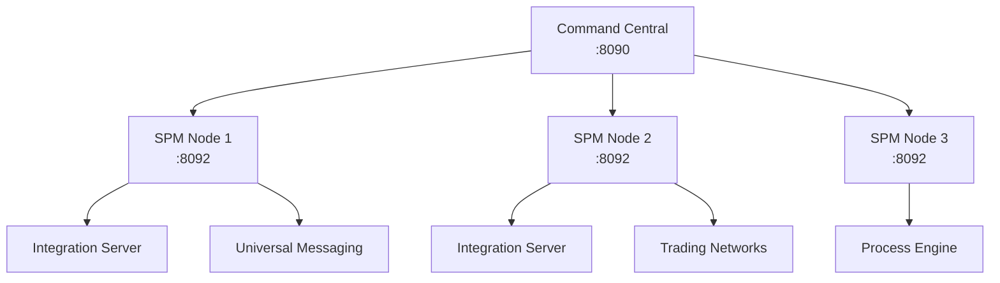

# Platform Manager (SPM)

## Presentation

**Software AG Platform Manager (SPM)** est l'agent local installe sur chaque noeud du landscape webMethods. Il permet a Command Central de :

- Deployer des produits sur le noeud
- Configurer les instances locales
- Monitorer l'etat des services
- Appliquer des fixes et mises a jour

---

## Role dans l'architecture



**SPM agit comme un agent qui :**

1. Recoit les commandes de CCE
2. Execute les operations localement
3. Rapporte l'etat a CCE
4. Gere le cycle de vie des produits

---

## Installation

### Installation avec CCE

Quand on installe Command Central, SPM est installe automatiquement sur le meme noeud.

```bash
# L'installateur CCE installe aussi SPM
./cc-def-10.15-fix8-lnxamd64.sh \
    -d /opt/SAGCommandCentral \
    -s 8092 \                    # SPM HTTP
    -S 8093 \                    # SPM HTTPS
    ...
```

### Installation standalone

Pour ajouter SPM sur un nouveau noeud :

```bash
# Depuis Command Central
sagcc create landscape nodes \
    name="New SPM Node" \
    alias=newSpmNode \
    url=http://new-host:8092

# Puis deployer SPM via CCE
sagcc exec provisioning composite apply \
    nodeAlias=newSpmNode \
    template=spm-layer
```

---

## Structure

```
/opt/SAGCommandCentral/profiles/SPM/
├── bin/
│   ├── startup.sh           # Demarrage
│   ├── shutdown.sh          # Arret
│   └── spmEnv.sh            # Variables environnement
├── configuration/
│   ├── config.ini           # Configuration principale
│   ├── wrapper.conf         # Configuration JVM
│   └── security/            # Certificats
├── logs/
│   ├── wrapper.log          # Log principal
│   └── spm.log              # Log application
└── workspace/               # Donnees runtime
```

---

## Ports et communication

| Port | Protocole | Usage |
|------|-----------|-------|
| 8092 | HTTP | API REST, communication CCE |
| 8093 | HTTPS | Communication securisee |

### Securisation

```bash
# Configurer HTTPS uniquement
# Dans configuration/config.ini
http.port=
https.port=8093
```

---

## Commandes de gestion

### Demarrage/Arret

```bash
# Demarrage
/opt/SAGCommandCentral/profiles/SPM/bin/startup.sh

# Arret
/opt/SAGCommandCentral/profiles/SPM/bin/shutdown.sh

# Via Supervisor
supervisorctl start platformmanager
supervisorctl stop platformmanager
supervisorctl restart platformmanager
```

### Verification status

```bash
# Status local
curl http://localhost:8092/spm/health

# Via CCE
sagcc get landscape nodes local status

# Liste des produits geres
sagcc list inventory products nodeAlias=local
```

---

## Integration avec CCE

### Enregistrement d'un node

```bash
# 1. Creer le node dans CCE
sagcc create landscape nodes \
    name="Production IS 1" \
    alias=prodIs1 \
    url=http://prod-is1:8092

# 2. Configurer les credentials
sagcc add security credentials \
    nodeAlias=prodIs1 \
    runtimeComponentId=SPM-CONNECTION \
    authenticationType=BASIC \
    username=Administrator \
    password=manage123

# 3. Verifier la connexion
sagcc get landscape nodes prodIs1 status
```

### Operations via CCE

```bash
# Lister les runtimes sur un node
sagcc list inventory runtimes nodeAlias=prodIs1

# Demarrer un runtime
sagcc exec lifecycle runtimes prodIs1 OSGI-IS_default start

# Arreter un runtime
sagcc exec lifecycle runtimes prodIs1 OSGI-IS_default stop

# Verifier l'etat
sagcc get monitoring runtimestatus prodIs1 OSGI-IS_default
```

---

## Gestion des produits

### Installation de produits

```bash
# Installer Integration Server sur un node
sagcc exec provisioning composite apply \
    nodeAlias=prodIs1 \
    template=is-layer \
    repo.product=wM10.15-products \
    repo.fix=wM10.15-fixes

# Verifier l'installation
sagcc list inventory products nodeAlias=prodIs1
```

### Application de fixes

```bash
# Lister les fixes disponibles
sagcc list repository fixes

# Appliquer un fix
sagcc exec provisioning composite apply \
    nodeAlias=prodIs1 \
    template=is-fixes \
    repo.fix=wM10.15-fixes
```

---

## Configuration Supervisor

```ini
# /etc/supervisor/conf.d/platformmanager.conf

[program:platformmanager]
command=/opt/SAGCommandCentral/profiles/SPM/bin/startup.sh
directory=/opt/SAGCommandCentral/profiles/SPM
user=wmuser
autostart=true
autorestart=true
startsecs=30
startretries=3
stdout_logfile=/var/log/supervisor/spm-stdout.log
stderr_logfile=/var/log/supervisor/spm-stderr.log
environment=SAG_HOME="/opt/SAGCommandCentral"
```

---

## Troubleshooting

### Logs

```bash
# Log principal
tail -f /opt/SAGCommandCentral/profiles/SPM/logs/wrapper.log

# Log applicatif
tail -f /opt/SAGCommandCentral/profiles/SPM/logs/spm.log

# Log Supervisor
tail -f /var/log/supervisor/spm-stdout.log
```

### Problemes courants

| Symptome | Cause probable | Solution |
|----------|----------------|----------|
| SPM ne demarre pas | Port occupe | `lsof -i :8092` |
| Connection refused | Firewall | Verifier iptables/security groups |
| CCE ne voit pas SPM | Mauvaise URL | Verifier url dans node config |
| Authentication failed | Mauvais credentials | Reconfigurer security credentials |

### Commandes diagnostiques

```bash
# Verifier que SPM ecoute
netstat -tlnp | grep 8092

# Test connexion locale
curl -v http://localhost:8092/spm/health

# Test depuis CCE
sagcc get landscape nodes <alias> status

# Logs en temps reel
journalctl -u supervisor -f
```

---

## Bonnes pratiques

1. **Un SPM par serveur** - Ne pas partager entre plusieurs VM
2. **Utiliser HTTPS en production** - Desactiver HTTP
3. **Monitorer les logs** - Configurer alertes sur erreurs
4. **Backup regulier** - Sauvegarder `/opt/SAGCommandCentral/profiles/SPM/configuration`
5. **Automatiser** - Utiliser Ansible pour deployer SPM sur nouveaux nodes
